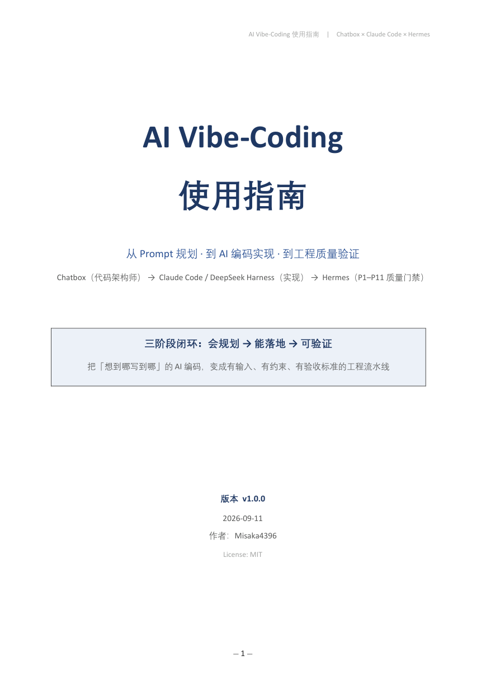
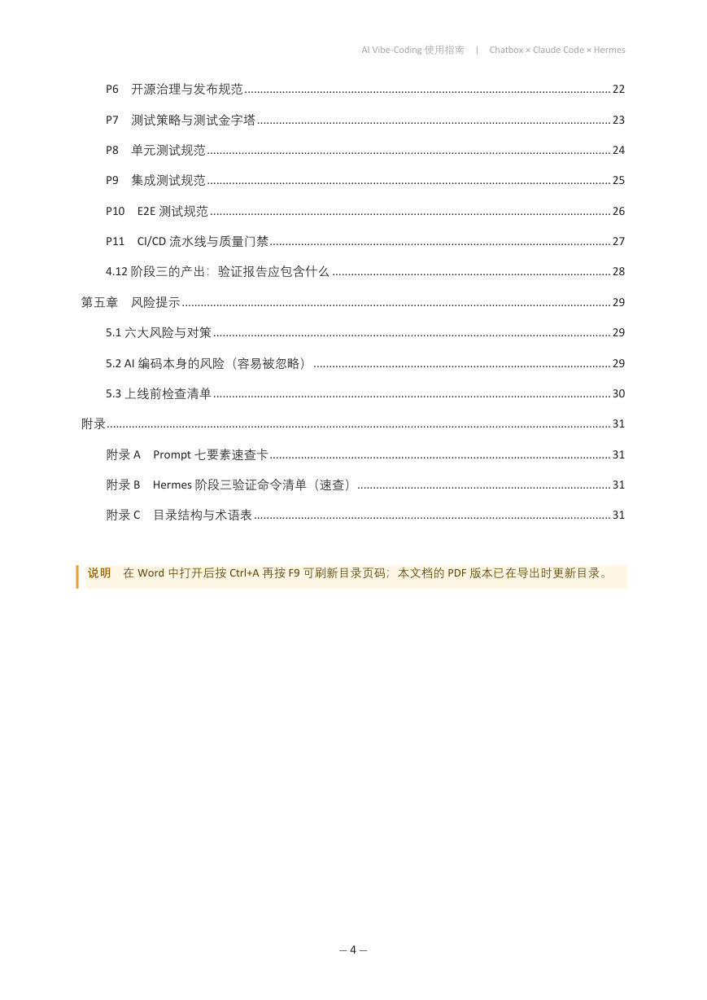
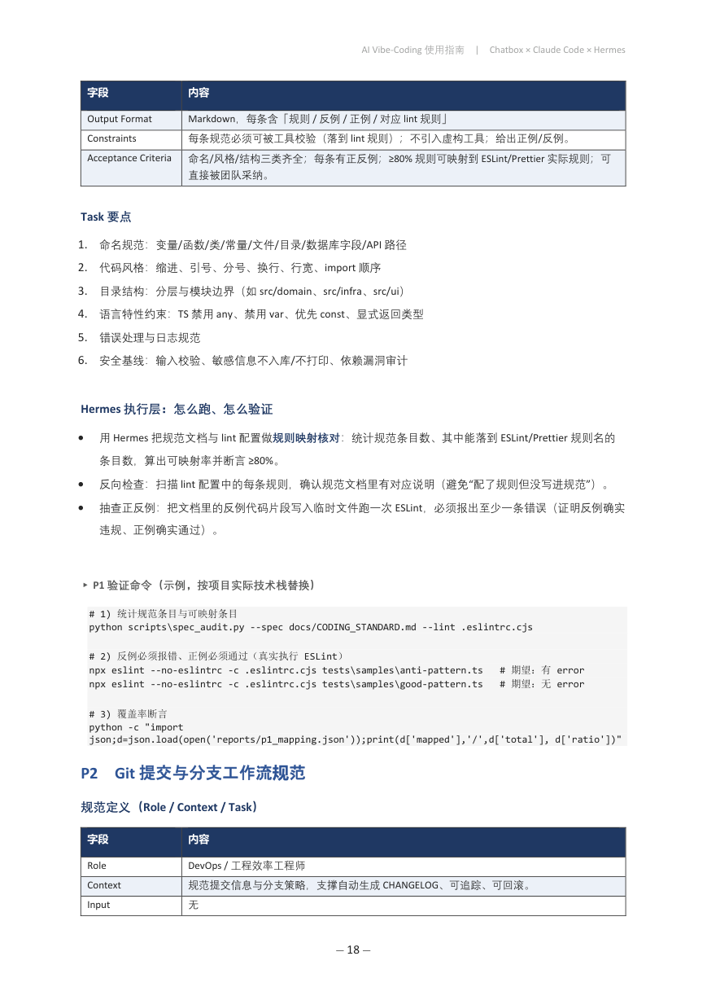

# AI Vibe-Coding 使用指南

[English](README.md) | **简体中文**

[](LICENSE)
[](docs/)
[](docs/AI-Vibe-Coding-Guide.pdf)
[](docs/AI-Vibe-Coding-Guide.pdf)
[](#四工程规范验证流程p1p11)
[](#)

> 把「想到哪写到哪」的 AI 氛围编程（Vibe-Coding），升级成一条**可复现、可验证的三阶段工程流水线**：
> 先用「代码架构师」角色把需求拆成结构化 Prompt 套件，再用 agentic 编码 CLI 落地实现，最后用一套固定的工程规范（P1–P11）逐项验证。

---

## 📖 目录

- [一、文档简介](#一文档简介)
- [二、三阶段流水线](#二三阶段流水线)
- [三、文档内容一览](#三文档内容一览)
- [四、工程规范验证流程（P1–P11）](#四工程规范验证流程p1p11)
- [五、功能特性](#五功能特性)
- [六、快速开始](#六快速开始)
- [七、文档预览](#七文档预览)
- [八、项目结构](#八项目结构)
- [九、验证记录](#九验证记录)
- [十、修改日志](#十修改日志)
- [十一、免责声明](#十一免责声明)
- [License](#license)

---

## 一、文档简介

AI 氛围编程效率极高，但有两个结构性缺陷：

| 缺陷 | 具体表现 |
|---|---|
| **不可复现** | 同一句「帮我加个登录」在不同时间会得到完全不同的实现，无法交接、无法复盘 |
| **不可验证** | AI 说「已完成」，但从没人定义过「完成」的标准是什么，质量全靠运气 |

本指南的做法是在前后各加一段：**前面加规划层**（把模糊需求翻译成七要素齐备的结构化 Prompt），**后面加验证层**（用 P1–P11 工程规范逐项审计并留下实测证据）。中间的执行层可以换成任何 agentic 编码工具。

## 二、三阶段流水线

| 阶段 | 使用工具 | 角色 | 产出物 | 完成的判据 |
|---|---|---|---|---|
| ① **规划** | Chatbox（代码架构师角色） | 把模糊需求翻译成结构化任务包 | 子任务清单 + 可执行 Prompt 套件 | 每个子任务都有输入、输出与验收标准 |
| ② **实现** | Claude Code（`--effort high`）/ DeepSeek Harness（`dsh`） | 按 Prompt 写代码、跑测试、提交 Git | 可运行代码 + Conventional Commits | 本地测试通过、工作区干净 |
| ③ **验证** | Hermes Agent + P1–P11 规范 | 按工程规范逐项审计、跑质量门禁 | 审计报告 + 验证证据（实测数字） | 11 项规范逐条评级、门禁确实能阻断不合规合并 |

```
 人的需求
    │
    ▼
① 规划层  Chatbox ·「代码架构师」
   复述需求 → 集中追问 → 五维度拆解 → 依赖排序 → 生成 Prompt
   产出：T-01 … T-NN 任务卡（Role/Context/Task/Constraints/Input/Format/Acceptance）
    │
    ▼
② 实现层  Claude Code (--effort high) / DeepSeek Harness (dsh)
   一次只喂一条 Prompt → 小步提交 → 本地自测 → 失败即回滚
   产出：代码 + 测试 + Conventional Commits 提交历史
    │
    ▼
③ 验证层  Hermes Agent · P1–P11
   P1–P6 规范类 · P7–P10 测试类 · P11 门禁类
   产出：审计报告（逐项评级 + 实测证据 + 缺口清单）
    │
    └── 不合格 ⇢ 回到阶段 ② 带约束重做
```

## 三、文档内容一览

| 章节 | 内容 |
|---|---|
| **第一章　总览** | 从氛围编程到工程流水线；五条核心原则（规划与执行分离 / Prompt 自包含 / 可校验优先 / 小步提交 / 验证看证据）；工具链定位速查 |
| **第二章　阶段一：用 Chatbox 生成任务 Prompt** | 完整可复制的「代码架构师」System Prompt；五步工作法；子任务卡七要素模板；五维度拆解框架（数据/逻辑/接口/表现/基础设施）；**完整实战示例**（一句需求 → 5 条集中追问 → 8 个 T-01…T-08 子任务 → 依赖 DAG → 2 条可直接投喂的生产级 Prompt → 风险与测试策略）；6 类常见失败模式与对策 |
| **第三章　阶段二：用 Claude Code 与 DeepSeek Harness 实现** | DeepSeek Anthropic 兼容端点配置；`--effort` 五挡位选择；单任务执行五步循环；git worktree 并行编排；实测 CLI 参数速查表；DeepSeek Harness（`dsh`）定位与启动方式；可追溯的提交信息规范 |
| **第四章　阶段三：用 Hermes 跑一遍测试流程** | P1–P11 共 11 项工程规范，每项含规范定义（Role/Context/Task/Constraints/Input/Output/Acceptance）+ **Hermes 执行层**（怎么跑、怎么验证）+ 可复制的验证命令 |
| **第五章　风险提示** | 六大结构性风险 + 六类 AI 编码特有风险 + 10 项上线前检查清单 |
| **附录** | Prompt 七要素速查卡；Hermes 验证命令清单；推荐目录结构；术语表 |

## 四、工程规范验证流程（P1–P11）

| 编号 | 规范主题 | 产出物 | 一句话验收 |
|---|---|---|---|
| P1 | 通用编码规范（命名/风格/结构） | 《编码规范》Markdown | ≥80% 规则可映射到 ESLint/Prettier 实际规则 |
| P2 | Git 提交与分支工作流规范 | 规范 + `commitlint.config` + PR 模板 | 提交格式可被 commitlint 直接校验 |
| P3 | Lint/Format 工具链与自动化落地 | `.eslintrc` / `.prettierrc` / lint-staged 配置 | 本地与 CI 规则一致；lint 失败阻断 CI |
| P4 | 文档与注释规范 | 规范 + README 模板 + JSDoc 示例 | API 文档可自动生成 |
| P5 | Code Review 规范 | 规范 + 可勾选 Checklist | 有流程时序、评论分级、时延 SLA |
| P6 | 开源治理与发布规范 | LICENSE / 贡献指南 / 模板 / 发布工作流 | 可实现半自动发布 |
| P7 | 测试策略与测试金字塔 | 策略文档 | 分层有边界定义、工具选型有理由 |
| P8 | 单元测试规范 | 规范 + 示例代码 | 有命名/结构/断言/mock 边界/反模式警示 |
| P9 | 集成测试规范 | 规范 + 示例 | 有范围、替身策略、数据隔离、防 flaky 准则 |
| P10 | E2E 测试规范 | 规范 + 示例用例 | 有选取原则、稳定选择器、等待重试、报告机制 |
| P11 | CI/CD 流水线与质量门禁 | 流水线 YAML + 说明文档 | 阶段完整、有缓存并行、覆盖率门禁、可阻断合并 |

## 五、功能特性

| 特性 | 说明 |
|---|---|
| 📐 **七要素 Prompt 模板** | Role / Context / Task / Constraints / Input / Format / Acceptance Criteria，缺一不可，模板可直接复制 |
| 🧭 **五维度拆解框架** | 数据 / 逻辑 / 接口 / 表现 / 基础设施，避免漏掉「基础设施」这类最后才想起、代价最高的部分 |
| 🧩 **端到端实战示例** | 用真实的「新闻聚合 + 每日 PDF 日报」需求走完全流程，含 8 个子任务、依赖 DAG 与 2 条完整 Prompt |
| ⌨️ **实测 CLI 参考** | Claude Code 的 `--effort` / `--permission-mode` / `--output-format` 等参数均来自 2026-09-11 实测环境 |
| 🔌 **DeepSeek Harness 章节** | 说明 `dsh` 的定位、启动方式，并明确标注其「开发者预览期会有破坏性变更」 |
| ✅ **可判定的验收标准** | 拒绝「代码要优雅」这类主观标准，一律换成命令或数字（如 `pytest -q` 全绿） |
| 🔍 **可证伪的门禁** | 明确要求「故意推一个注定失败的改动，看 CI 是否真的阻断」，并给这种只写在 YAML 里、不生效的门禁起了名字：**假门禁** |
| 🧨 **反模式警示** | 100% 覆盖率陷阱、快照滥用、flaky 测试腐蚀测试信心、静默失败、密钥泄漏、上下文漂移 |
| 📄 **双格式交付** | 可编辑 `.docx` + 已渲染 `.pdf`（目录含页码，32 页 / 34 张表） |
| 🔁 **可重新生成** | 内容源与排版逻辑都在 `tools/build_guide.py`，改完可一键重建 |

## 六、快速开始

文档以 Word 形式交付，并附带同版 PDF：

| 文件 | 用途 |
|---|---|
| [`docs/AI-Vibe-Coding-Guide.docx`](docs/AI-Vibe-Coding-Guide.docx) | 可编辑的 Word 版本 —— fork 后改成你自己团队的规范 |
| [`docs/AI-Vibe-Coding-Guide.pdf`](docs/AI-Vibe-Coding-Guide.pdf) | 打印 / 分享版本，32 页，目录已带页码 |

直接阅读：克隆仓库后打开 `docs/AI-Vibe-Coding-Guide.docx`（或 `.pdf`）即可。

想改成自己团队的规范并重新生成：

```powershell
# 1) 安装依赖（只需 python-docx）
pip install python-docx

# 2) 编辑内容源 tools/build_guide.py 后重新生成 Word
python tools/build_guide.py docs\AI-Vibe-Coding-Guide.docx

# 3) 需要 PDF 时，用 Word 打开并另存为 PDF（或在 Word 中按 Ctrl+A → F9 刷新目录页码）
```

> 在 Word 中打开文档后按 `Ctrl+A` 再按 `F9`，可以刷新目录页码。

## 七、文档预览







## 八、项目结构

```
AI-Vibe-Coding-Guide/
├─ docs/
│   ├─ AI-Vibe-Coding-Guide.docx      # 可编辑的 Word 交付物（32 页）
│   └─ AI-Vibe-Coding-Guide.pdf       # 渲染后的 PDF（目录页码已更新）
├─ assets/                            # README 中引用的预览图
├─ tools/
│   └─ build_guide.py                 # 内容源 + 排版逻辑，可重新生成 DOCX
├─ README.md                          # 英文版说明
├─ README.zh.md                       # 本文件（简体中文）
├─ CHANGELOG.md                       # Keep a Changelog 格式修改日志
└─ LICENSE                            # MIT
```

## 九、验证记录

文档构建于 2026-09-11 用真实工具链验证，而非仅靠人工通读：

| 检查项 | 方法 | 结果 |
|---|---|---|
| Word 可无修复打开 | Word COM 自动化 `Documents.Open` | ✅ PASS —— 1714 段落 / 34 张表格 |
| 可导出 PDF | Word `ExportAsFixedFormat` | ✅ PASS —— 32 页，1.30 MB |
| 目录页码已解析 | `TablesOfContents(1).Update()` 后重新分页 | ✅ PASS —— 页码齐全（填目录后 30 → 32 页） |
| 文本层是真文本 | `pymupdf` 逐页 `get_text()` + 关键词检索 | ✅ PASS —— 「代码架构师」11 处、「P11」19 处、「Hermes」58 处 |
| 无缺字方块 | 扫描抽取文本中的 U+FFFD / □ | ✅ PASS —— 0 处 |
| 无残留 Markdown 标记 | 扫描抽取文本中的字面 `**` / 反引号 | ✅ PASS —— 仅保留代码块中刻意的通配符（`tests\unit\**\*.ts`） |

## 十、修改日志

见 [CHANGELOG.md](CHANGELOG.md)。

## 十一、免责声明

- 本文档中的工具名、命令行参数与配置结构均来自 **2026-09-11 的实测环境**；软件迭代较快，具体版本号请以各工具官方文档为准。文档本身刻意**不写死版本号**，避免产出过期配置。
- **DeepSeek Harness 处于开发者预览（developer preview）阶段**，官方明确提示会有兼容性破坏变更，请勿直接用于生产关键路径，运行前请先阅读其 `SAFETY.md`。
- 文档中的第 P6 项涉及许可证选择，**仅作技术建议，不构成法律意见**。
- 文档中的验证命令为示例，需按你项目的实际技术栈替换。

## License

[MIT](LICENSE) © 2026 Misaka4396
